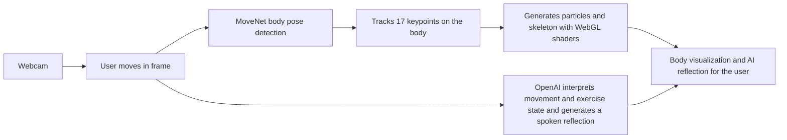

# Movement Dialogue — Flowchart for Designers

A simple flowchart of **user interaction** and **technical implementation**. One input, two parallel streams, one combined experience.

---

## How it works

**In plain terms:**  
The webcam captures the user. From that single input, two things happen in parallel: (1) pose is tracked and turned into a real-time body visualization (particles + skeleton); (2) movement and exercise data are sent to the AI, which occasionally speaks a short reflection. Both streams come together as the experience the user sees and hears.

---

## How to use

- Paste the Mermaid block into [mermaid.live](https://mermaid.live) to edit or export as PNG/SVG.  
- Use in Notion, Figma (via Mermaid plugin), or slides.

For vision, design principles, and interaction details, see **EMBODIED_RECOVERY_EXPERIENCE_CONCEPT.md**.
