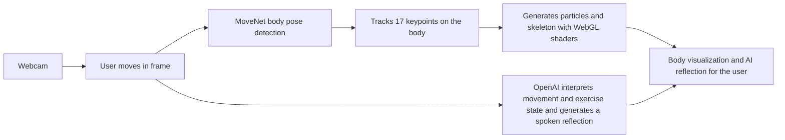

# An Embodied Recovery Experience  
## Concept document for an interactive installation exploring body, recovery, and AI companionship

---

## 1. Vision

**Movement Dialogue** is an interactive installation that turns rehabilitation into a shared, embodied dialogue. The participant’s body is tracked in real time and reflected as a living visualization—a “neural network” of light—while an AI companion observes movement and speaks only when it matters: short, grounded reflections that acknowledge difficulty, mark progress, and stay out of the way. The experience sits at the intersection of **body**, **recovery**, and **AI companionship**: the body as the primary interface, recovery as a non-linear journey, and the AI as a quiet presence rather than a coach or therapist.

---

## 2. Design principles (for designers)

| Principle | Meaning in this experience |
|-----------|----------------------------|
| **Body as interface** | No controllers. The camera sees the whole body; movement drives both the visual world and the logic (reps, form, range). The participant *is* the input. |
| **Reflection, not instruction** | The AI notices and reflects. It does not correct, cheerlead, or therapize. Tone: direct, kind, sparse. |
| **Presence over performance** | Metrics (reps, range, form) inform the system and the companion’s context, but the focus is on being present with the body, not hitting targets. |
| **Ambient awareness** | The visualization (particles, skeleton, pulses) responds to motion, range, and stability so the participant can *feel* their movement reflected without reading numbers. |
| **Contemplative pacing** | The companion speaks at most every ~22 seconds and only when something is worth noting—first rep, milestones, new range, form shift, or rare ambient observation. |

---

## 3. User flow (high level)

```
┌─────────────────────────────────────────────────────────────────────────────┐
│                         EMBODIED RECOVERY — USER JOURNEY                      │
└─────────────────────────────────────────────────────────────────────────────┘

  [Load]          [Choose]           [Move]                [Reflect]         [End]
    │                 │                  │                     │                │
    ▼                 ▼                  ▼                     ▼                ▼
  Camera          Exercise            Body in                 AI speaks       Back to
  + Model         selected            frame                  when it         selection
  ready           Session             ↓                      matters         (summary
    │             starts              Visualization            │            optional)
    │                 │                  │                     │                │
    │                 │                  ├─ Skeleton + fill    ├─ Greeting     │
    │                 │                  ├─ Particle cloud    ├─ Rep / range  │
    │                 │                  ├─ Pulses on motion   ├─ Form /       │
    │                 │                  └─ Metrics (live)     │   ambient     │
    │                 │                                       └─ Voice + text  │
    └─────────────────┴───────────────────────────────────────────────────────┘
```

1. **Entry** — Loading: camera starts, pose model loads. Optional: set API key for voice companion.
2. **Choice** — User selects one ACL recovery exercise from a set (e.g. Straight Leg Raise, Wall Squat, Calf Raises). This sets the “rules” for what counts as a rep and what the companion talks about.
3. **Session** — Overlay hides; full-body visualization is live. User performs the exercise in view of the camera.
4. **Loop** — Pose → analysis (angle, phase, reps, form) → visualization updates (particles, pulses, bloom) → companion may speak (text + TTS) when triggered.
5. **Exit** — User ends session; returns to exercise selection. Companion and analyzer reset.

---

## 4. How it works — flowchart (for designers)

Single input, two parallel streams, one combined experience.



**Designer takeaways**

- **Single input:** one webcam. Everything (visualization and AI) comes from the same pose stream.
- **Two streams:** (1) pose → keypoints → particles and skeleton; (2) movement and exercise state → AI → spoken reflection. They meet in what the user sees and hears.
- **Companion is gated:** the AI speaks only when triggered (e.g. first rep, milestones, new range) and at most every ~22 seconds. Exercise choice sets which joints and reps the system tracks and what the AI talks about.

---

## 5. Interaction map (designer-friendly)

| Where | What the user does | What the system does | Design notes |
|-------|--------------------|----------------------|--------------|
| **Exercise overlay** | Clicks an exercise card | Starts session; loads exercise definition; shows HUD; optional AI greeting | Entry point; copy and hierarchy set tone (recovery, not fitness). |
| **Canvas** | Moves in frame; optional click/tap | Pose drives visualization; click triggers a pulse in 3D | Click is playful feedback; can be removed or repurposed in installation. |
| **HUD (during session)** | Reads reps, range, form cue, AI line | Reps/angle from analyzer; form cue from form check; AI line when companion speaks | Form cue and AI text are the only “instructional” surfaces; keep minimal. |
| **Voice** | Hears companion | TTS plays queued reflections; “Speaking” indicator on HUD | Tone and frequency matter more than content volume. |
| **Theme / sensitivity** | Picks palette; adjusts sensitivity | Changes color palette; scales velocity/jitter/ROM influence on visuals | Sensitivity affects how “reactive” the visualization feels. |
| **Pause / Skeleton / Reset** | Freezes view; toggles skeleton; resets camera | Pause stops pose-driven updates; skeleton toggles connection mesh; reset camera | Useful for demos and calibration. |
| **End session** | Clicks End Session | Stops analyzer and companion; returns to exercise grid | Natural exit; summary could be added (reps, time, best range). |

---

## 6. Technical implementation (short overview for design handoff)

- **Pose:** Browser webcam → TensorFlow.js MoveNet (SINGLEPOSE_LIGHTNING) → 17 keypoints, smoothed, mapped to a 3D world (fixed scale, depth by keypoint).
- **Visualization:** Three.js. One layer of keypoint nodes + interpolated fill points, one subdivided connection mesh (bones, torso grid, head ring), one large particle system (~18k) tethered to body-volume segments and a flow field. Shaders use time, jitter, range of motion, and velocity for breathing, pulse waves, and bloom. Presence (tracking confidence over time) fades the body in/out.
- **Exercise logic:** Per-exercise definition: primary angle (3 keypoints), rest/peak angle bands, optional form-check angle and cue. State machine: rest → active (in peak range) → returning (back to rest) → rep counted. Outputs: rep count, current angle, phase, form quality, form cue, best range, tempo.
- **AI companion:** Trigger logic runs each frame; if conditions met and cooldown passed, build a text context (exercise, reps, phase, tempo, form, body metrics, trigger type) and call OpenAI Chat (gpt-4o-mini, low max_tokens). Response is shown on HUD and sent to OpenAI TTS (nova); audio is queued so only one phrase plays at a time.

This gives designers a clear picture: **one pose pipeline**, **one exercise state**, **one companion** with **strict trigger and pacing rules**, and **one visual pipeline** that can be rethemed or simplified without changing the core flow.

---

## 7. Installation framing (for curators and partners)

As an **interactive installation**, the piece can be framed as:

- **Body as data and material:** The participant’s skeleton and inferred volume become the only input. The work makes visible the normally invisible: joint angles, stability, range, and the rhythm of recovery.
- **Recovery as non-linear:** Reps and range are tracked, but the companion does not optimize for “more.” It acknowledges difficulty and progress in the same register. The installation can be used in rehab or wellness contexts without promising outcomes.
- **AI as quiet presence:** The companion is tuned to speak rarely and in plain language. It avoids performative warmth and therapy-speak. The design choice is “companion” not “coach”—suitable for reflective or care-oriented settings.

Suggested contexts: gallery or museum installations, rehab or wellness pop-ups, research labs exploring body–AI interaction, or as a reference implementation for “embodied AI” in health.

---

## 8. Document control

- **Audience:** Designers, creative technologists, curators, partners.
- **Purpose:** Explain user flow, interaction, and technical implementation so design decisions (when to speak, what to show, how to simplify for installation) can be made with full context.
- **Repo:** This concept lives with the Movement Dialogue codebase; the system diagram and interaction map can be exported to Figma or Notion as needed.

---

*Movement Dialogue — An Embodied Recovery Experience. Body, recovery, and AI companionship.*
